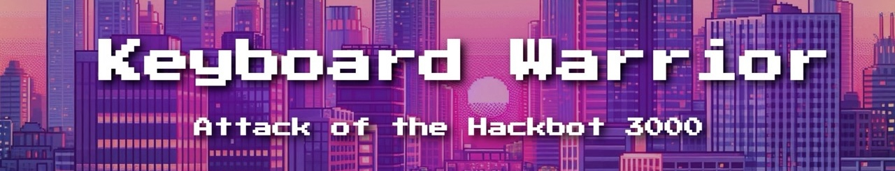
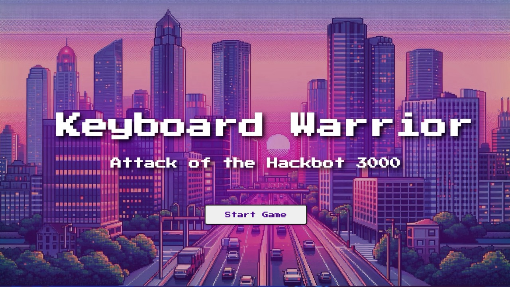
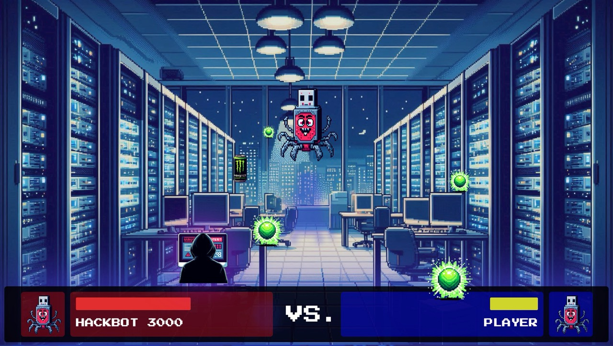
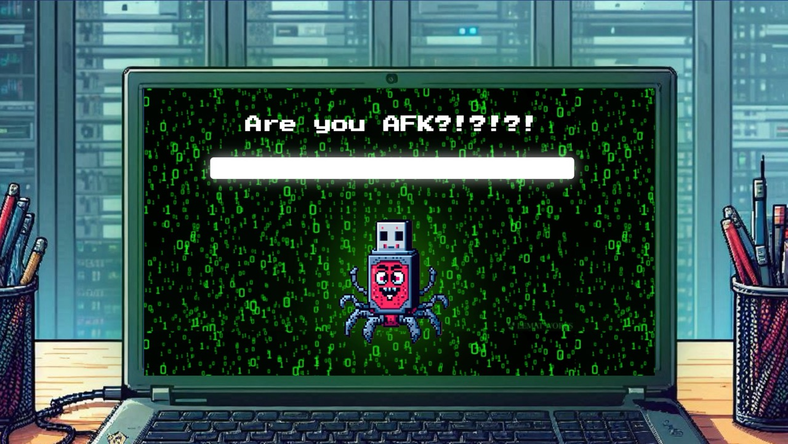

# keyboard-warrior-game

## Game Description

Syntax Warrior is an exciting and fast-paced game where players take on the role of a hacker battling against various projectiles and enemies. The objective is to survive as long as possible while collecting power-ups and defeating bosses. The game features multiple levels, each with increasing difficulty and unique challenges.

## Game Storyline

The game is about a junior software engineer who finds a USB stick on the ground while on the way to the office for a night shift.

When the midnight comes the USB stick comes alive - it’s the evil Hackbot 3000!

Will your skills be 1337 enough to defeat the your evil adversary and save the IT infrastructure of your company or will you have to watch your office burn when the morning comes?

The answer is in your fingertips!

## Game Highlights

- **Engaging Gameplay**: Fast-paced action with challenging levels and boss battles.
- **Power-Ups**: Collect power-ups to increase your health and gain special abilities.
- **Boss Battles**: Face off against powerful bosses with unique attack patterns.
- **Dynamic Visuals**: Stunning graphics and animations that enhance the gaming experience.
- **Sound Effects**: Immersive sound effects and background music to keep you engaged.

## Key Code Information

- **Game Loop**: The main game loop is managed using `setInterval` to update the game state and render the game screen at a consistent frame rate.
- **Collision Detection**: Collision detection is implemented to check for interactions between the player and projectiles, as well as between projectiles and the game boundaries.
- **Boss Battle**: The boss battle logic includes a countdown timer, dynamic status updates, and health adjustments based on the player's performance.
- **Audio Management**: Various sound effects and background music are managed using the `Audio` object, with volume controls and playback functions.

## Link to GitHub.io Page

[Play Syntax Warrior Online](https://hesersu.github.io/syntax-warrior-game)

## Link to Asset Sources

[Bing AI Image Generator](https://www.bing.com/images/create)
[Suno AI Music Generator](https://suno.com/)
[Sample Focus Audio Samples](https://samplefocus.com/)

## Screenshots

&ensp;

Main Menu

&ensp;

Game Fight Screen

Game Hacking Boss Battle Screen

&ensp;
